# MyGarden

# Objective:

MyGarden is an application that allows anyone to easily plot an edible garden. Users can focus on the more relaxed motions of building and watching their efforts come to fruition.

### [<ins>MyGarden deployed via Heroku</ins>](https://getmygarden.herokuapp.com/)

# Installation:

## Prerequisites

### Docker

This project relies on Docker to run the PostgreSQL server. You must install
Docker first before continuing.

Use one of these methods:

- Use [Homebrew](https://brew.sh) on macOS:

```sh
brew install --cask docker
```

- [Follow the instructions on the Docker website](https://docs.docker.com/get-docker/)

Once you've installed Docker Desktop, you'll need to launch the app. On macOS,
it's located in `/Applications/Docker`.

### Node

You'll need to install Node v14 or above. [`nvm`](https://github.com/nvm-sh/nvm) is highly recommended.

### Set Up the Development Environment

#### Install NPM Packages

```sh
npm install
```

### Set Up `postgres` User Password and Database Name

Set up information in order to start a new
PostgreSQL server instance, as well as to connect to it later from the Express
server.

1. Copy the example environment file

   ```sh
   cp .env.example .env
   ```

2. You can choose to edit `.env` or just use as-is.

[See the PostgreSQL Docker image documentation for more
information](https://hub.docker.com/_/postgres).

### Initialize the Database

Let's set up the database server, create the application database, and seed it
with some data. You only need to do this the first time you set up your
development environment.

```sh
npm run db:init
```

ℹ️ If you ever need to start over with the database, you can run this command
again which will delete your existing data and start from scratch.

## Start your Development Environment

```sh
npm start
```

Visit <http://localhost:3000>.

## Shut Down the Development Environment

1. `Ctrl-C` to stop the Express and React development servers.
2. To stop and destroy the PostgreSQL Docker container run. (Don't worry, your data is safe.)
   ```sh
   `npm run db:stop`
   ```

## Need to Start a `psql` Session?

```sh
npm run psql
```

# Technologies:

1. PostgreSQL, Object-Relational Database
2. Express, backend
3. React, frontend
4. NodeJS, serving Express and React

[//]: # "5. Heroku and GitHub, deployment"

# Application Programming Interfaces:

1. [Auth0 (authentication)](https://cloud.google.com/endpoints/docs/openapi/authenticating-users-auth0?hl=en&_ga=2.68038099.-376004971.1618853601)
2. [OpenWeatherMap API](https://openweathermap.org/api/one-call-api)
3. [Zoning & Vegetation (Trefle)](https://docs.trefle.io/docs/examples/snippets/)
4. [Plant Hardiness Zones (Walkdoj)](https://github.com/waldoj/frostline)
5. [Plants For A Future Database](https://pfaf.org/user/Default.aspx)
6. [Tropical Fruit and Veg](http://tropicalfruitandveg.com/tfvapi.php)
7. [growstuff.org](https://github.com/Growstuff/growstuff/wiki/API-Version-0)
   - Alpha quality software as of 2014

# Minimal Viable Product Priorities:

### [<ins>Google Doc for MyGarden Project development</ins>](https://docs.google.com/document/d/1HtaY2To8yLveDVoQvEU87eZn97pXQrGPm29APZE1Gio/edit?usp=sharing)

### MVP 1:

- Login with Facebook or Google account
- Display facts about user’s zone, based on user’s zipcode input
- Display suggested plants based on user’s zone
- If user opts for Indoor growing, display plants that don’t need full sun

### MVP 2:

- User can store plant selections
- User can group plant selections
- User can name plant groupings (containers)

### MVP 3:

- Plant companions will be displayed
- Plant Groupings will display care instructions per group
  - Soil type, watering, light, fertilizer needs
  - Spacing, if necessary
- Links, with disclaimers, to helpful articles

### Nice-to-Haves:

- Notify user of upcoming significant changes in weather
- Harsh weather conditions expected //edge cases
  - Watering reminders
  - Coverings for Heat waves/Frost
- Maintenance Tracking
  - Timer/Scheduling
    - Watering
    - Light
    - Fertilizer
    - Transplanting Needs
      - Crop rotation
      - Repotting

# Technical Risks:

- PLENTY! First time exploring external API calls
- Auth0 is said to be difficult to set up, if this takes longer than a day, MVPs may need to be shortened and re-assigned
- Cross-referencing APIs may prove difficult, if so, steps will be simplified further
- Figure out appropriate conditionals to display great suggestions for plants and the corresponding care instructions
- Need to design clean display content with CSS

# Database Schema:

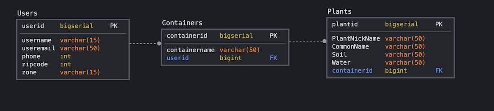

# User Flowchart:

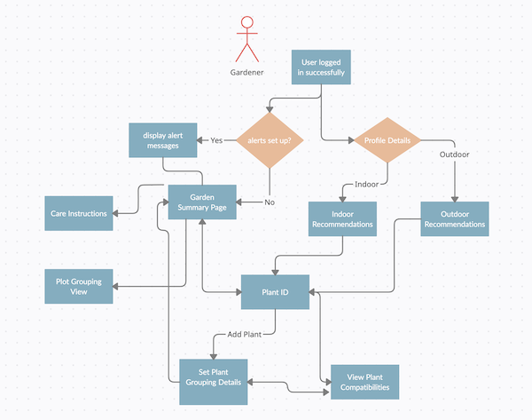

# Wireframes:

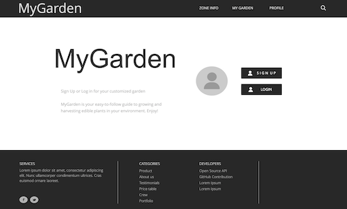
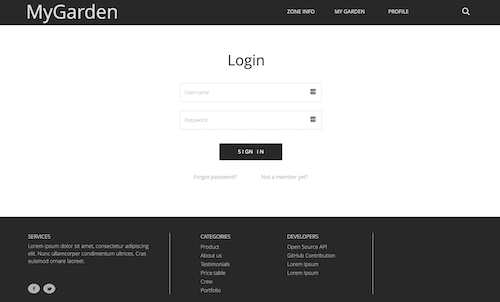
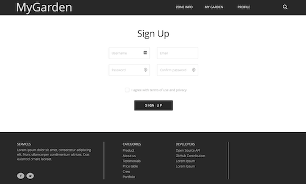
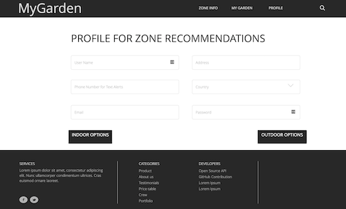
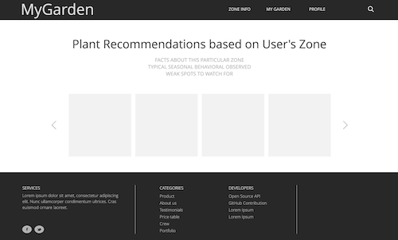
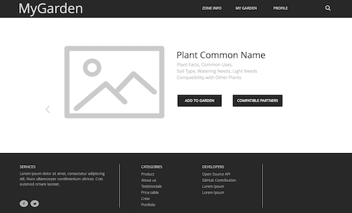
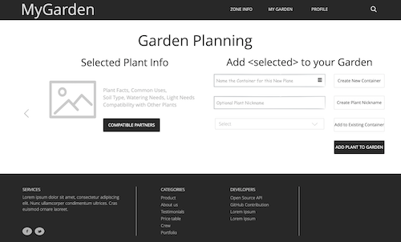
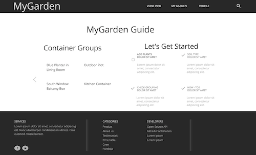
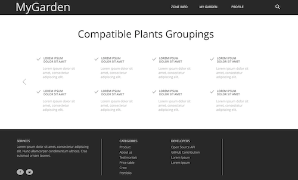
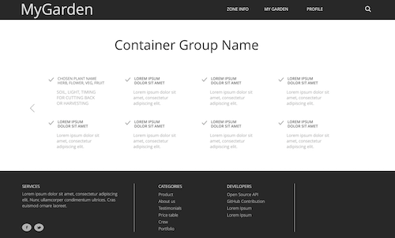
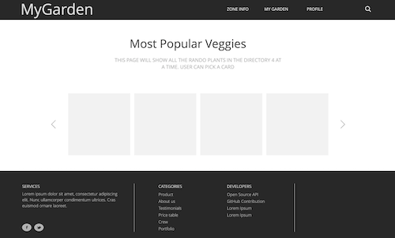
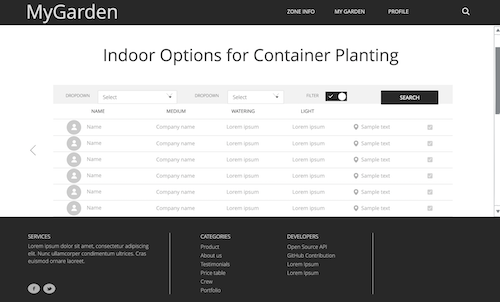
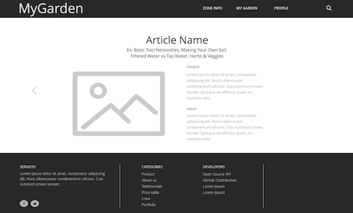

# Supplemental Readings:

- Biointensive Farming Growing Ecosystems of Hope
