# MyGarden

## Objective:

MyGarden is an application that allows anyone to easily plot an edible garden, based on their needs. Users can focus on the more relaxed motions of building and watching their efforts come to fruition. 

## Installation:
<adding instructions after completion of MVP1>

## Technologies:

1. PostgreSQL, Object-Relational Database
2. Express, backend
3. React, frontend
4. NodeJS, serving Express and React

[//]: # "5. Heroku and GitHub, deployment"

## Application Programming Interfaces:

1. Auth0 (authentication)
2. Google’s Weather
3. Zoning & Vegetation (Trefle)
4. Plant Hardiness Zones (Walkdoj)
5. Plants For A Future Database
6. Tropical Fruit and Veg
7. growstuff.org
   - Alpha quality software as of 2014

## Minimal Viable Product Priorities:

### MVP 1:

- Login with Facebook or Google account
- Display facts about user’s zone, based on user’s zipcode input
- Display suggested plants based on user’s zone
- If user opts for Indoor growing, display plants that don’t need full sun

### MVP 2:

- User can store plant selections
- User can group plant selections
- User can name plant groupings (containers)

### MVP 3:

- Plant companions will be displayed
- Plant Groupings will display care instructions per group
  - Soil type, watering, light, fertilizer needs
  - Spacing, if necessary
- Links, with disclaimers, to helpful articles

### Nice-to-Haves:

- Notify user of upcoming significant changes in weather
- Harsh weather conditions expected //edge cases
  - Watering reminders
  - Coverings for Heat waves/Frost
- Maintenance Tracking
  - Timer/Scheduling
    - Watering
    - Light
    - Fertilizer
    - Transplanting Needs
      - Crop rotation
      - Repotting

## Technical Risks:

- PLENTY! First time exploring external API calls
- Auth0 is said to be difficult to set up, if this takes longer than a day, MVPs may need to be shortened and re-assigned
- Cross-referencing APIs may prove difficult, if so, steps will be simplified further
- Figure out appropriate conditionals to display great suggestions for plants and the corresponding care instructions
- Need to design clean display content with CSS

## Database Schema

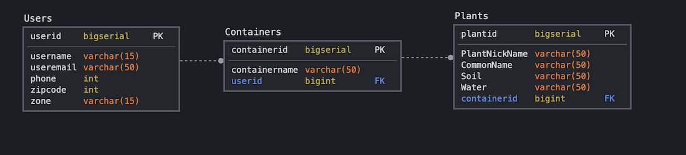

## Wireframes

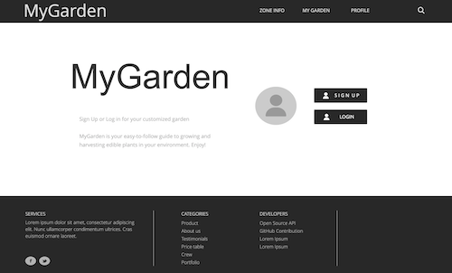
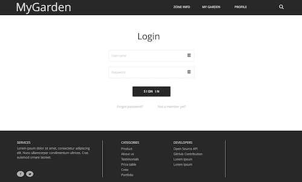
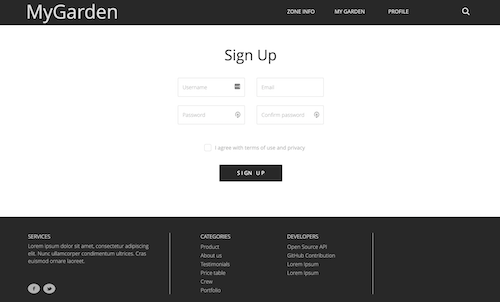
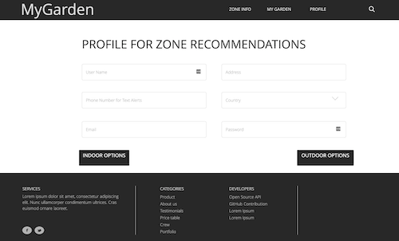
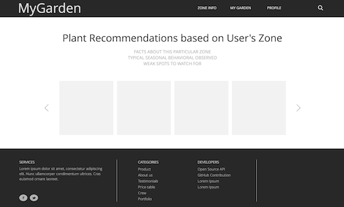
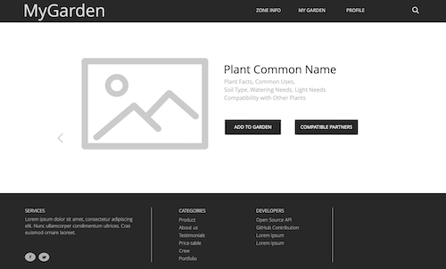
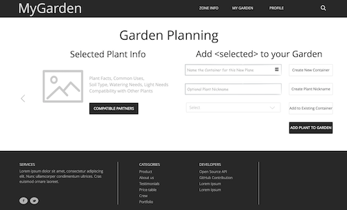
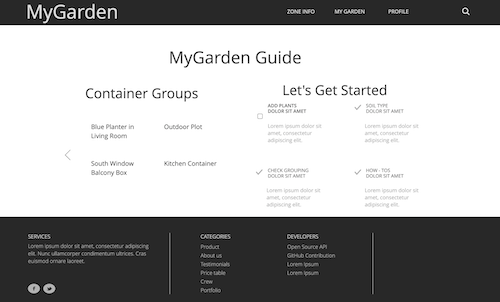
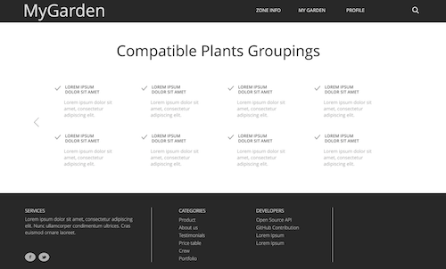
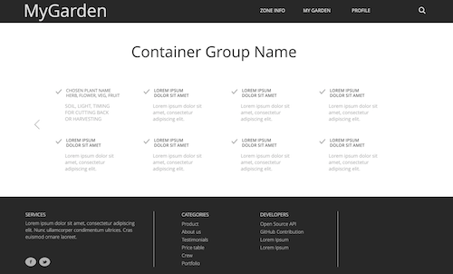
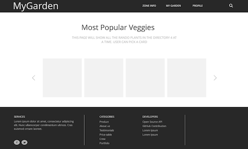
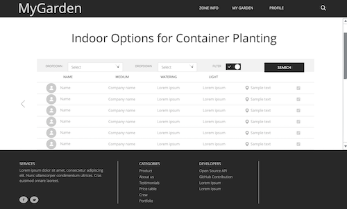
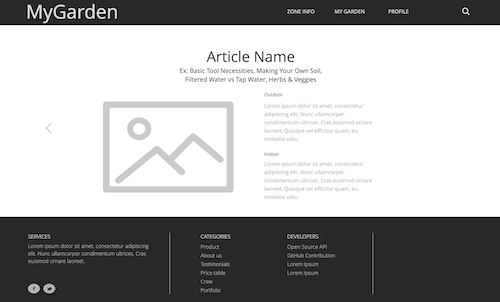

## Supplemental Readings:

- Biointensive Farming Growing Ecosystems of Hope
